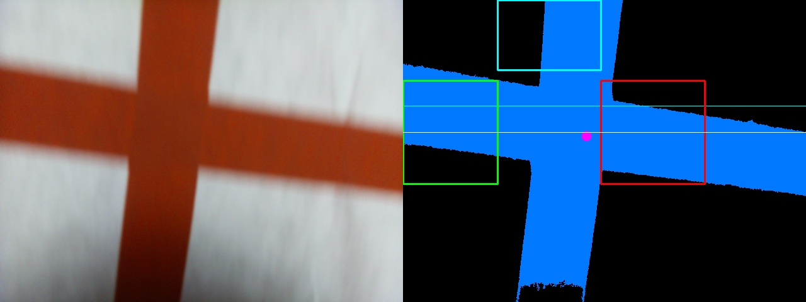
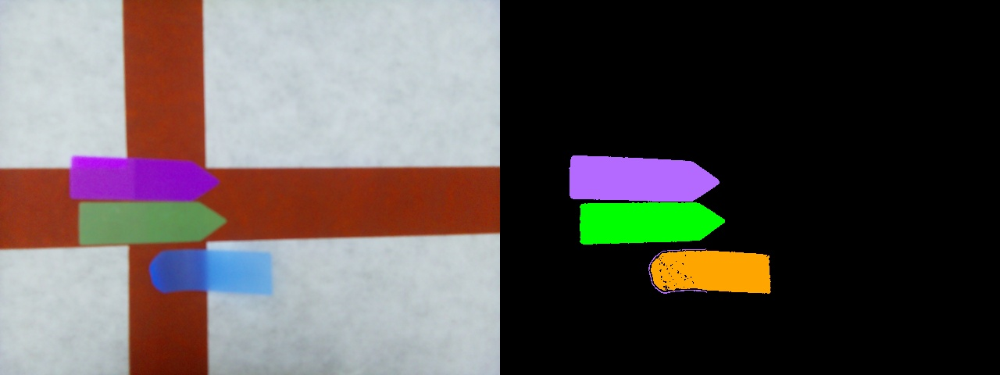

# SPIS Robotics Final Project (Summer 2026)

Autonomous line-following and maze-mapping robot built on a Raspberry Pi for UCSD's Summer Program for Incoming Students (SPIS).

The robot tracks blue painter's tape on dark carpet, handles 90° turns and 3-way/4-way intersections using OpenCV, and remembers visited intersections using color-marker "hashing" (Green, Yellow, Orange, Pink).

---

## Demo

<!-- Drop your main demo GIF or MP4 into the assets/ folder and update the link below -->
<!-- For video files: GitHub supports dragging .mp4 files directly into issues/PRs or READMEs -->


_(Replace `assets/robot_demo.gif` with your demo video/GIF)_

---

## How It Works

### 1. Line Following & Steering

- **Tape Tracking:** Grabs camera frames, converts them to HSV, and masks out blue painter's tape (`Hue: 95–135`) while ignoring carpet noise and small specks (< 500 px).
- **P-Controller:** Calculates how far the center of the line is from the middle of the frame (`shift` from `-1.0` to `1.0`), then dynamically slows down the inner wheel to steer smoothly (`STRAIGHT_KP = 1.0`).
- **Static Friction Kickstart:** When starting from a stop, the motors get a quick 50ms burst at full power (`1.0`) to break static friction on the carpet before dropping down to normal drive speed.

<!-- Line following demo GIF/clip -->
<!--  -->

### 2. Intersection Detection (Grid Zone Probing)

Instead of relying on fragile horizontal slices or contours that get messed up by diagonal approaches and torn tape edges, the camera uses an anchored probing grid:

```
                  [ STRAIGHT PROBE ] (Cyan)
                          |
   [ LEFT PROBE ] ------ (+) ------ [ RIGHT PROBE ]
       (Green)        junction_y        (Red)
                          |
                      [ STEM ]
                     (stem_cx)
```

1. **Stem Anchor:** Measures the center (`stem_cx`) and width (`stem_width`) of the tape directly in front of the robot at the bottom of the frame.
2. **Crossbar Check:** Scans row widths to find the thickest band of blue (`junction_y`). If that row is at least $1.5\times$ wider than the stem, an intersection crossbar is present.
3. **Probing:** Places three square sampling boxes (Left, Right, Straight) around the junction. If blue pixel density inside a box is $>15\%$, that path is open:
   - Left only $\rightarrow$ 90° Left turn
   - Right only $\rightarrow$ 90° Right turn
   - Multiple paths $\rightarrow$ 3-way or 4-way intersection


_Live camera capture (left) alongside the OpenCV blue-tape mask with Left (Green), Right (Red), and Straight (Cyan) probe boxes._

### 3. Making 90° Turns

When an intersection or sharp corner is detected:

1. **Axle Alignment:** Drives forward for `0.3s` (`TURN_FORWARD_DELAY`) so the wheels end up right over the intersection rather than cutting the corner early.
2. **Pivot:** Rotates in place for at least `0.7s` (`MIN_TURN_DURATION`).
3. **Visual Lock-on:** Keeps rotating until the camera sees `Direction.STRAIGHT` for 2 consecutive frames, guaranteeing it locked onto the new perpendicular line before driving forward again.

<!-- Turn in action GIF -->
<!--  -->

### 4. Node Recognition (Color Hashing)

Instead of running heavy ORB feature matching on the Pi (which is slow and struggles with slight perspective changes), intersections are tagged with colored stickers (Green, Yellow, Orange, Pink):

- `get_color_hash()` counts pixels matching each color in HSV.
- If a color has $>200$ pixels, it's counted. Two nodes match if their color pixel counts are within a 40% margin of each other.
- Whenever a new intersection is found, it saves a side-by-side debug image to `debug_image/` showing the raw view next to the color mask.


_Intersection tagged with colored stickers (left) alongside the multi-color HSV isolation mask (right) used for node hashing._

---

## Hardware & Wiring

- **Compute:** Raspberry Pi + PiCamera Module 2
- **Motors:** 2x DC gearmotors + dual H-bridge motor driver + rear caster
- **Power:** 5V USB battery bank (Pi) + separate battery pack (motors)

<!-- Hardware photo placeholder -->
<!--  -->

| Motor     | IN1     | IN2     | PWM     | Notes                                        |
| :-------- | :------ | :------ | :------ | :------------------------------------------- |
| **Left**  | GPIO 25 | GPIO 18 | GPIO 23 | Scaled at `1.0`                              |
| **Right** | GPIO 16 | GPIO 12 | GPIO 24 | Scaled at `0.85` (trimmed to drive straight) |

---
